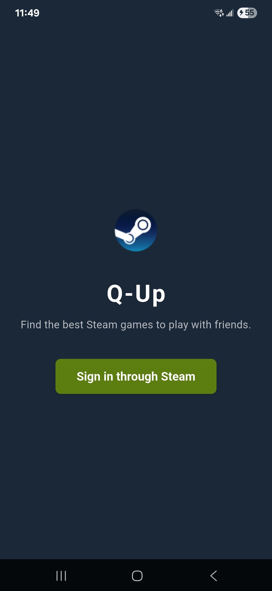
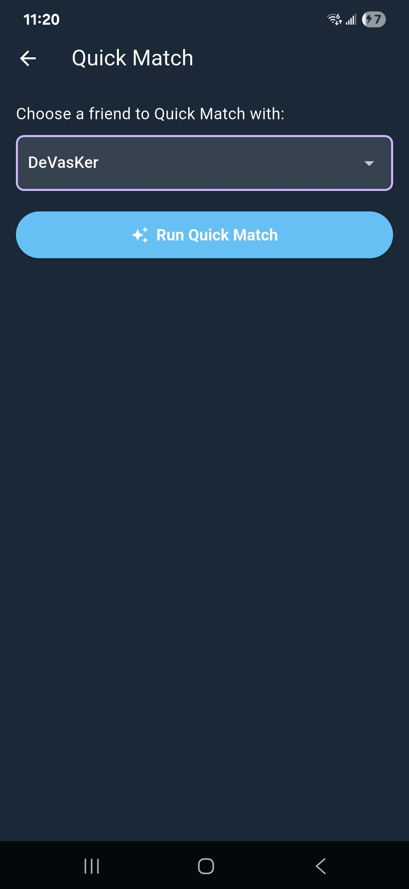
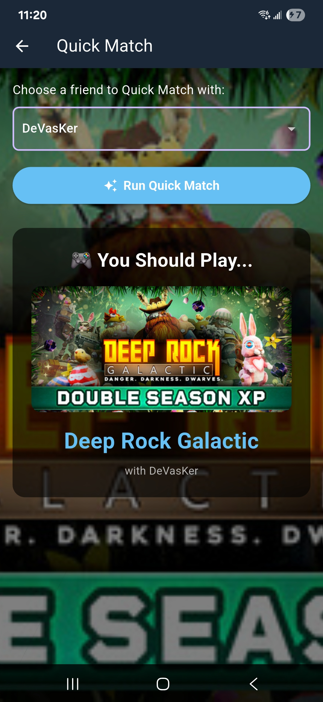
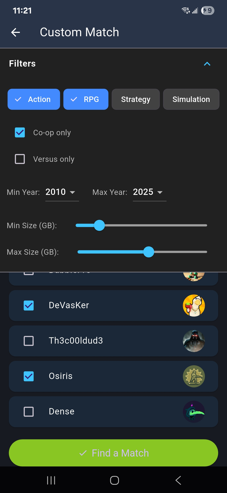
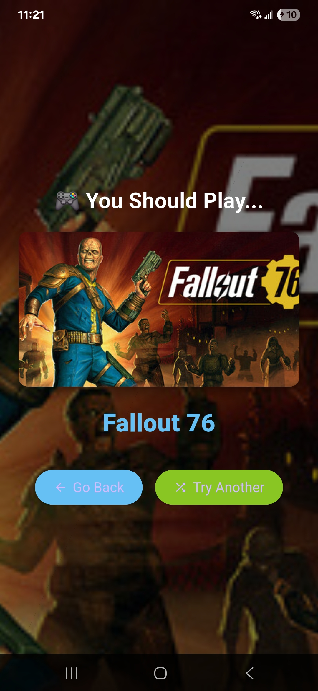
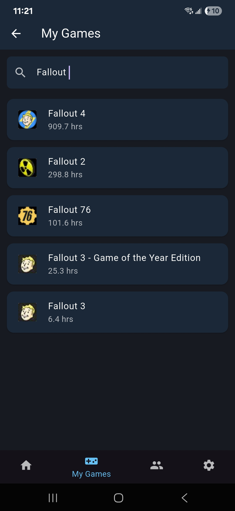
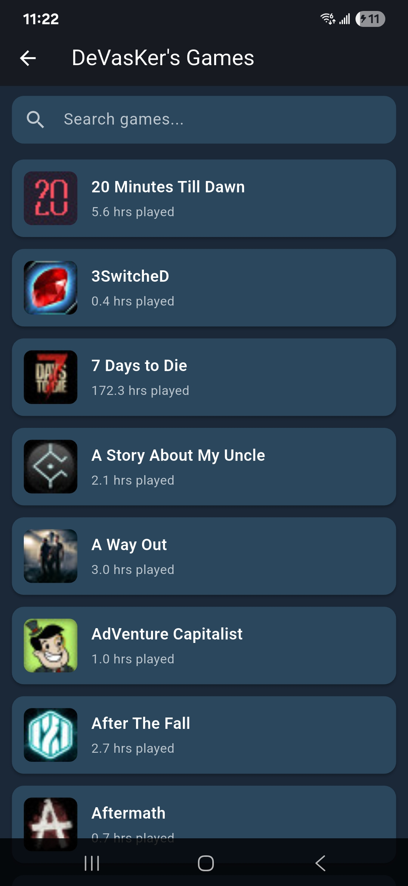
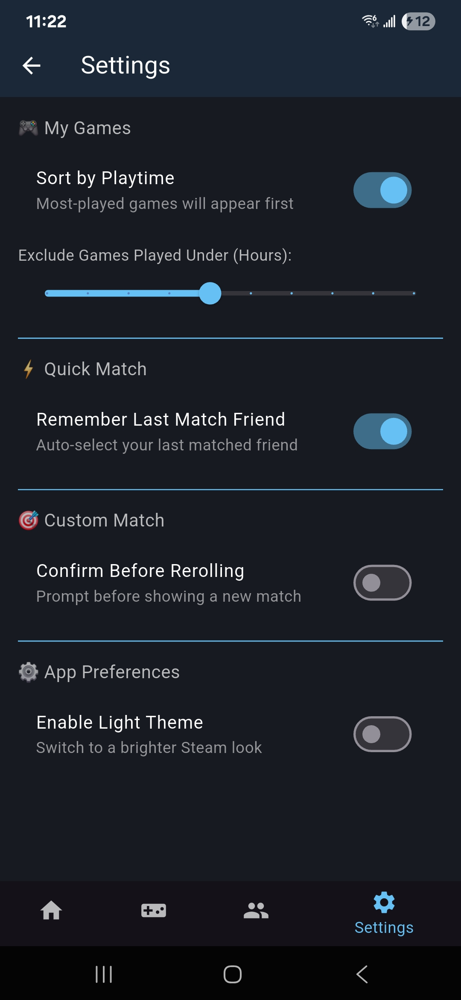

# QUp! – The Steam Mobile App  
Find the best Steam games to play with friends.

  

QUp! is a cross-platform mobile app built with Flutter and Node.js that helps you and your friends instantly find multiplayer games you both own.  
Sign in with Steam, browse your libraries, and use quick or custom filters to match the perfect game.

---

## Features

- **Steam Login** – Secure sign-in using your Steam account  
- **Quick Match** – Pick a friend and instantly see games you both own  
- **Custom Match** – Filter by genres, tags, playtime, and release year  
- **My Games** – Browse your library, sorted by playtime  
- **Friends’ Games** – Compare your friends’ libraries  
- **Modern UI** – Clean, mobile-first design with dark mode  

---

## Demo Walkthrough

A look at the main screens in the app.

### Quick Match  
Pick a friend and instantly find a shared game.

  

### Quick Match Result  
Your best shared game, highlighted.

  

### Custom Match  
Use filters to find something specific.

  

### Custom Match Results  
Curated results based on your filters.

  

### My Games  
Your entire Steam library, sorted by playtime.

  

### Friends’ Games  
See what your friends play most.

  

### Settings  
Manage preferences and app settings.

  

---

**## Tech Stack

- **Client:** Flutter (Dart)  
- **Backend:** Node.js (Express)  
- **API:** Steam Web API  
- **Authentication:** Steam OpenID  
- **Web Deployment:** Flutter Web + Node API (Render)

**Live Web Version (optional):**  
Add your Render link here once deployed.**## Tech Stack

- **Client:** Flutter (Dart)
- **Backend:** Node.js (Express)
- **API:** Steam Web API
- **Authentication:** Steam OpenID
- **Web Deployment:** Flutter Web + Node API (Render)

### Live Web Demo
Try the web version here:  
**https://qup-thesteammobileapp.onrender.com/**

---

## How It Works

1. Sign in with Steam.  
2. The app loads your Steam library and friends list.  
3. Choose Quick Match or Custom Match.  
4. QUp! finds games you both own and sorts them based on your filters.

---

## Setup & Run

For full setup instructions, see the client README:

`Client/steam-mobile-client/README.md`

---

## License

MIT
