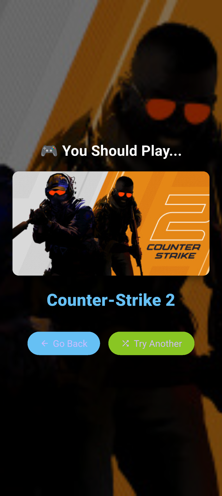
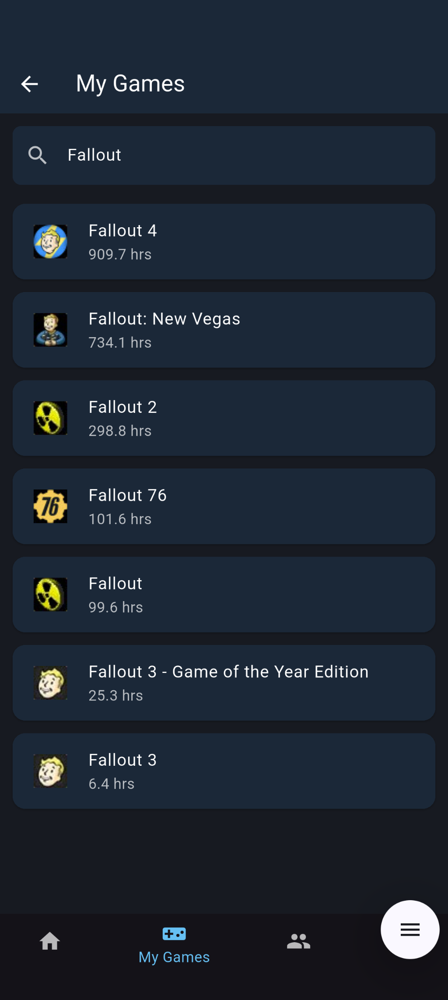

# Q-Up
# QUp! The Steam Mobile App 🎮

Q-Up helps you and your friends find the best Steam games to play together. Sign in with Steam, see your friends' libraries, and discover multiplayer games you all own—filtered by genre, playtime, and more.

## Features

- **Sign in with Steam**: Secure authentication to access your game library and friends list.
- **Quick Match**: Instantly find a game you and a selected friend both own.
- **Custom Match**: Filter by genres, tags, playtime, year, and more to find the perfect game for your group.
- **My Games**: Browse and search your Steam library, sorted by playtime.
- **Settings**: Personalize your experience with sorting, filters, and theme options.

## Screenshots

### Landing Screen


### Quick Match


### Quick Match Result


### Custom Match


### Custom Match Result


### My Games


### Settings


## How It Works

1. **Sign in through Steam** to securely connect your account.
2. **See your friends** and their shared games.
3. **Use Quick Match** to instantly get a game suggestion for you and a friend.
4. **Try Custom Match** to filter by genre, tags, playtime, year, and more for group recommendations.
5. **Browse your library** and search for games you own.
6. **Adjust settings** to personalize your experience.

## Tech Stack

- **Flutter** (Dart) for cross-platform mobile app development
- **Node.js/Express** backend (see `/API/steam-auth-api/`)
- **Steam Web API** for game and friend data
- **http** package for API requests

## Getting Started

1. Clone this repository.
2. Set up the backend (see `/API/steam-auth-api/README.md`).
3. In the `Client` directory, run:
   ```sh
   flutter pub get
   flutter run
   ```
4. Open the app, sign in with Steam, and start matching!

---

```bash
cd API
npm install
node index.js
